envi: Environmental Interpolation using Spatial Kernel Density Estimation 
===================================================

<h2 id="overview">

Overview

</h2>

The `envi` package is a suite of `R` functions to estimate the ecological niche of a species and predict the spatial distribution of the ecological niche -- a version of environmental interpolation -- with spatial kernel density estimation techniques. A two group comparison (e.g., presence and absence locations of a single species) is conducted using the spatial relative risk function that is estimated using the [sparr](https://CRAN.R-project.org/package=sparr) package. Internal cross-validation and basic visualization are also supported. 

<h2 id="install">

Installation

</h2>

To install the release version from CRAN:

    install.packages("envi")

To install the development version from GitHub:

    devtools::install_github("Waller-SUSAN/envi")

<h2 id="available-functions">

Available functions

</h2>

<table>
<colgroup>
<col width="30%" />
<col width="70%" />
</colgroup>
<thead>
<tr class="header">
<th>Function</th>
<th>Description</th>
</tr>
</thead>
<tbody>
<td><code>lrren</code></td>
<td>Main function. Estimate an ecological niche using the spatial relative risk function and predict its location in geographic space.</td>
</tr>
<td><code>perlrren</code></td>
<td>Sensitivity analysis for <code>lrren</code> whereby observation locations are spatially perturbed ("jittered") with specified radii, iteratively.</td>
</tr>
<td><code>plot_obs</code></td>
<td>Display multiple plots of the estimated ecological niche from <code>lrren</code> output.</td>
</tr>
<td><code>plot_predict</code></td>
<td>Display multiple plots of the predicted spatial distribution from <code>lrren</code> output.</td>
</tr>
<td><code>plot_cv</code></td>
<td>Display multiple plots of internal k-fold cross-validation diagnostics from <code>lrren</code> output.</td>
</tr>
<td><code>plot_perturb</code></td>
<td>Display multiple plots of output from <code>perlrren</code> including prediced spatial distribution of the summary statistics.</td>
</tr>
<td><code>div_plot</code></td>
<td>Called within <code>plot_obs</code>, <code>plot_predict</code>, and <code>plot_perturb</code>, provides functionality for basic visualization of surfaces with diverging color palettes.</td>
</tr>
<td><code>seq_plot</code></td>
<td>Called within <code>plot_perturb</code>, provides functionality for basic visualization of surfaces with sequential color palettes.</td>
</tr>
</tbody>
<table>

<h2 id="authors">

Authors

</h2>

* **Ian D. Buller** - *Environmental Health Sciences, Emory University, Atlanta, Georgia.* - [GitHub](https://github.com/idblr)

See also the list of [contributors](https://github.com/Waller-SUSAN/envi/graphs/contributors) who participated in this package, including:

* **Lance A. Waller** - *Biostatistics and Bioinformatics, Emory University, Atlanta, Georgia.* - [GitHub](https://github.com/lance-waller)

## Usage

### For the lrren() function

```r
set.seed(1234) # for reproducibility

# ------------------ #
# Necessary packages #
# ------------------ #

library(envi)
library(raster)
library(spatstat.core)
library(spatstat.data)

# -------------- #
# Prepare inputs #
# -------------- #

# Using the 'bei' and 'bei.extra' data within {spatstat.data}

# Environmental Covariates
elev <- spatstat.data::bei.extra[[1]]
grad <- spatstat.data::bei.extra[[2]]
elev$v <- scale(elev)
grad$v <- scale(grad)
elev_raster <- raster::raster(elev)
grad_raster <- raster::raster(grad)

# Presence data
presence <- spatstat.data::bei
spatstat.core::marks(presence) <- data.frame("presence" = rep(1, presence),
                                        "lon" = presence$x,
                                        "lat" = presence$y)
spatstat.core::marks(presence)$elev <- elev[presence]
spatstat.core::marks(presence)$grad <- grad[presence]

# (Pseudo-)Absence data
absence <- spatstat.core::rpoispp(0.008, win = elev)
spatstat.core::marks(absence) <- data.frame("presence" = rep(0, absence$n),
                                            "lon" = absence$x,
                                            "lat" = absence$y)
spatstat.core::marks(absence)$elev <- elev[absence]
spatstat.core::marks(absence)$grad <- grad[absence]

# Combine
obs_locs <- spatstat.core::superimpose(presence, absence, check = FALSE)
obs_locs <- spatstat.core::marks(obs_locs)
obs_locs$id <- seq(1, nrow(obs_locs), 1)
obs_locs <- obs_locs[ , c(6, 2, 3, 1, 4, 5)]

# Prediction Data
predict_locs <- data.frame(raster::rasterToPoints(elev_raster))
predict_locs$layer2 <- raster::extract(grad_raster, predict_locs[, 1:2])

# ----------- #
# Run lrren() #
# ----------- #

test <- lrren(obs_locs = obs_locs,
              predict_locs = predict_locs,
              predict = TRUE,
              cv = TRUE)

# -------------- #
# Run plot_obs() #
# -------------- #

plot_obs(test)

# ------------------ #
# Run plot_predict() #
# ------------------ #

plot_predict(test,
             cref0 = "+init=epsg:5472",
             cref1 = "+init=epsg:4326")

# ------------- #
# Run plot_cv() #
# ------------- #

plot_cv(test)

```
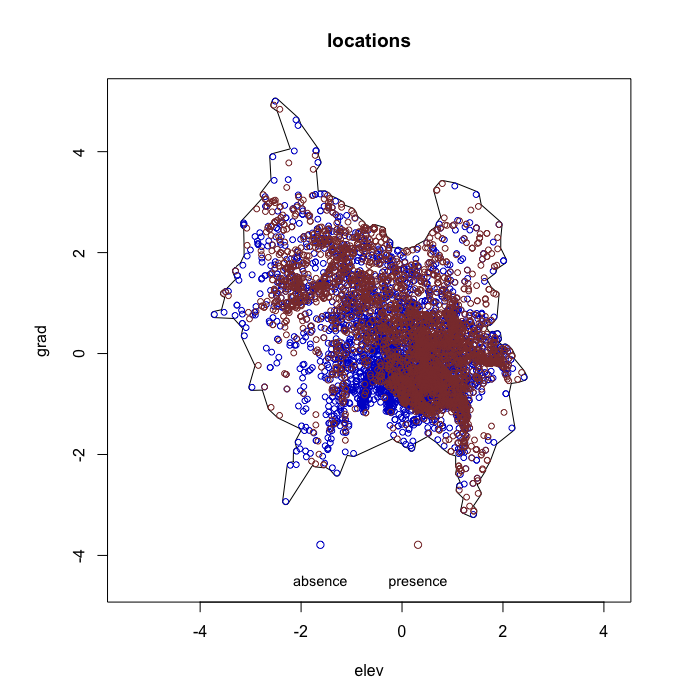

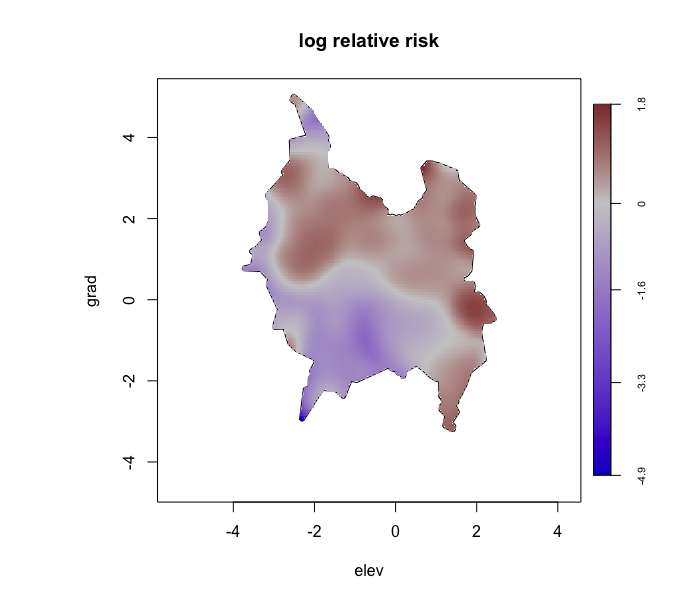

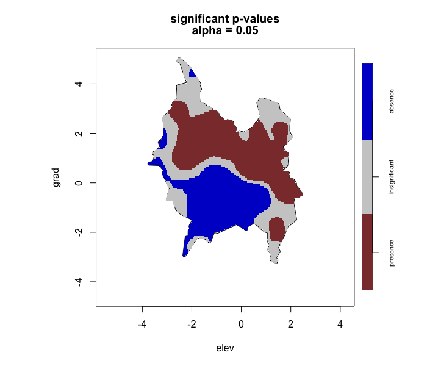

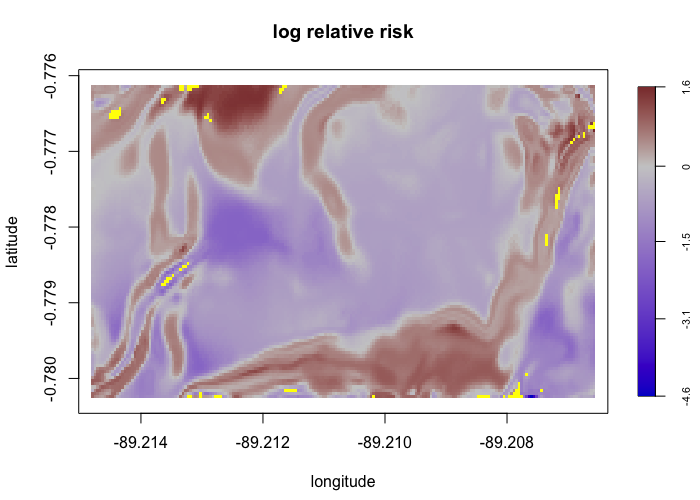

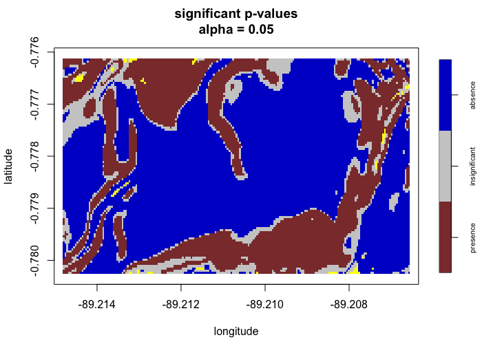

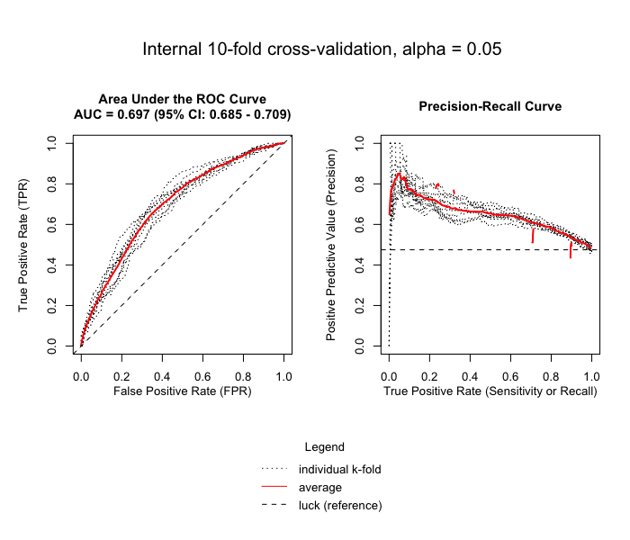

### For the perlrren() function

```r
set.seed(1234) # for reproducibility

# ------------------ #
# Necessary packages #
# ------------------ #

library(envi)
library(raster)
library(spatstat.core)
library(spatstat.data)

# -------------- #
# Prepare inputs #
# -------------- #

# Using the 'bei' and 'bei.extra' data within {spatstat.data}

# Scale environmental covariates
ims <- spatstat.data::bei.extra
ims[[1]]$v <- scale(ims[[1]]$v)
ims[[2]]$v <- scale(ims[[2]]$v)

# Presence data
presence <- spatstat.data::bei
spatstat.core::marks(presence) <- data.frame("presence" = rep(1, presence$n),
                                             "lon" = presence$x,
                                             "lat" = presence$y)

# (Pseudo-)Absence data
absence <- spatstat.core::rpoispp(0.008, win = ims[[1]])
spatstat.core::marks(absence) <- data.frame("presence" = rep(0, absence$n),
                                            "lon" = absence$x,
                                            "lat" = absence$y)

# Combine and create 'id' and 'levels' features
obs_locs <- spatstat.core::superimpose(presence, absence, check = FALSE)
spatstat.core::marks(obs_locs)$id <- seq(1, obs_locs$n, 1)
spatstat.core::marks(obs_locs)$levels <- as.factor(stats::rpois(obs_locs$n, lambda = 0.05))
spatstat.core::marks(obs_locs) <- spatstat.core::marks(obs_locs)[ , c(4, 2, 3, 1, 5)]

# -------------- #
# Run perlrren() #
# -------------- #

# Uncertainty in observation locations
## Most observations within 10 meters
## Some observations within 100 meters
## Few observations within 500 meters

test1 <- perlrren(obs_ppp = obs_locs,
                  covariates = ims,
                  radii = c(10,100,500),
                  n_sim = 100)
                 
# ------------------ #
# Run plot_perturb() #
# ------------------ #

plot_perturb(test1,
             cref0 = "+init=epsg:5472",
             cref1 = "+init=epsg:4326",
             cov_labs = c("elev", "grad"))

```

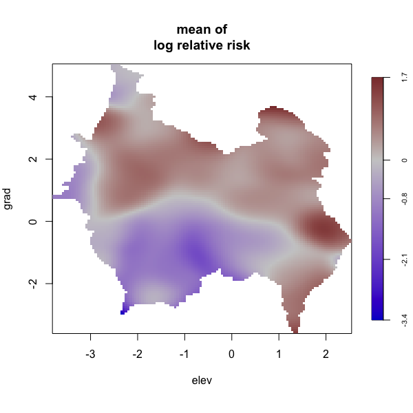

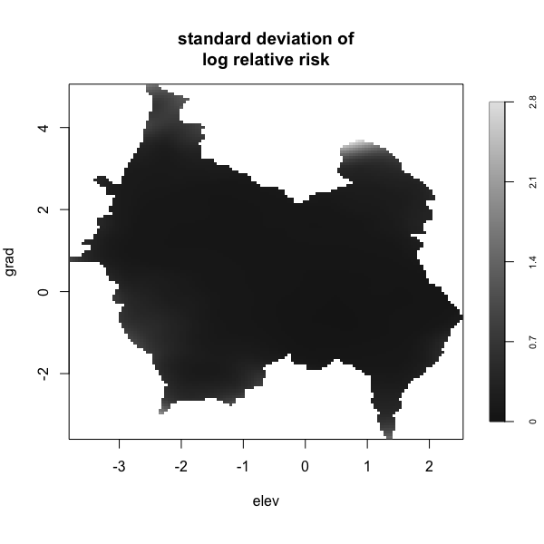

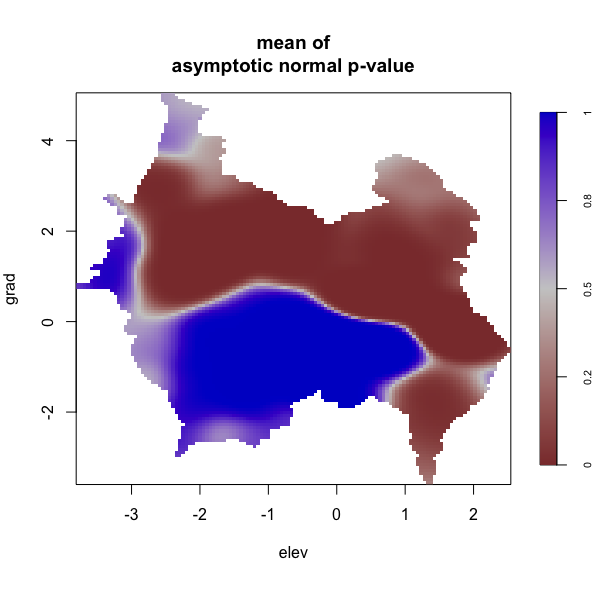

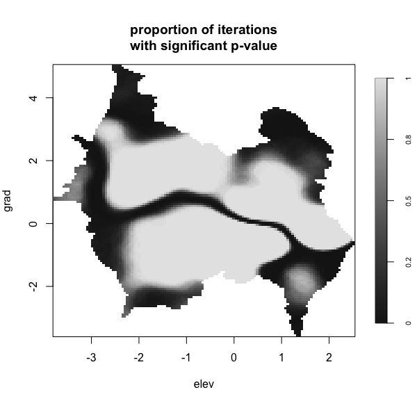

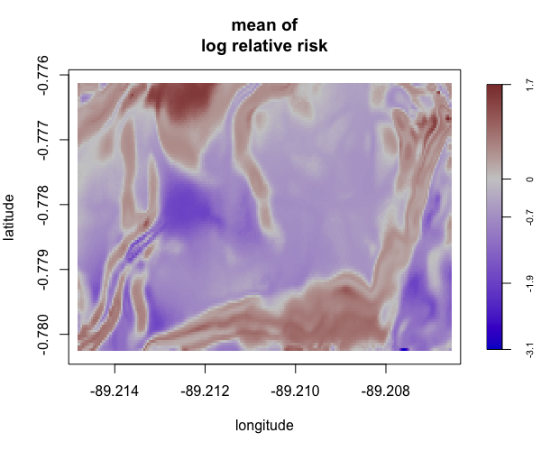

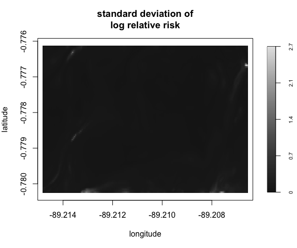

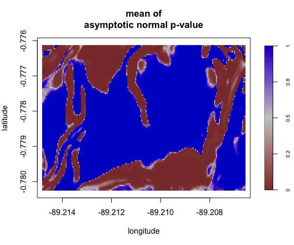

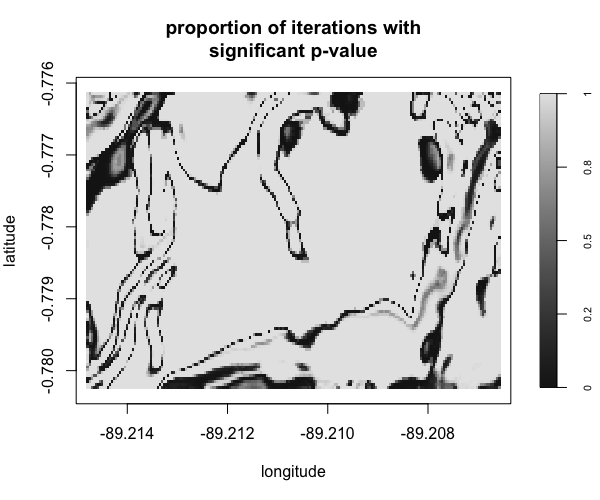
